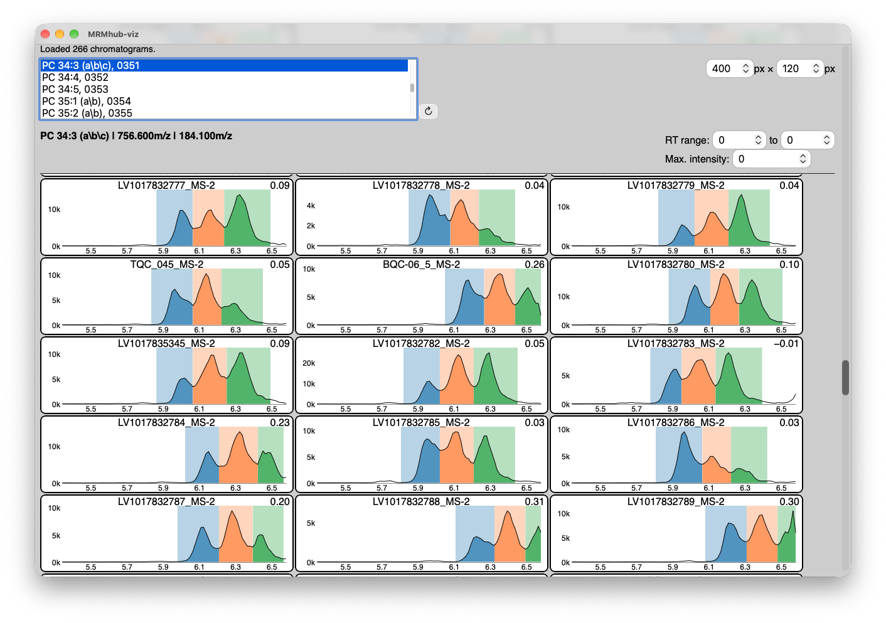

**MRMhub-viz** is a standalone, interactive application for reviewing the peak-integration results
produced by INTEGRATOR (see [Processing Workflow — Step 3](running.qmd)). It reads the binary results
written to the `misc/` folder during peak integration, so Step 3 must have been run at least once
before a dataset can be displayed.

## Running MRMhub-viz

MRMhub-viz is a self-contained executable (~10 MB) that resides in the same folder as the **MRMhub**
application. It is started by double-clicking `MRMhub-viz` (macOS) or `MRMhub-viz.exe` (Windows), or
from a terminal opened in the project folder. On first launch after download the operating system
shows a one-time security prompt — see
[clearing the security prompt](setup.qmd#clearing-the-first-launch-security-prompt).

## Chromatogram and integration review

The transition to inspect is selected from the list in the top-left corner. For that
transition, the extracted ion chromatograms of the individual samples are shown together with the
detected peak and its left and right integration borders, so the integration can be reviewed across
the entire analytical sequence at a glance. Moving the pointer over a chromatogram reports the exact
retention time at the cursor — the value used when defining fixed peak borders in the transition list
(see [Input Files — Transition list](input-files.qmd)).

The list also contains the reference samples (marked `REF`), each showing all transitions of that
sample. For a transition, the displayed retention-time range and maximum intensity can be set, and the
size of the chromatogram panels is adjustable; changes to these settings are applied immediately.
Loaded data are cached, and chromatograms appear as they load and are drawn only as they scroll into
view, so large projects remain responsive. A status line above the list reports loading progress and
errors; selecting another entry cancels a load in progress. After INTEGRATOR has been re-run, the ↻
button reloads the results from `misc/`.

{fig-alt="Screenshot of the MRMhub-viz window. The status line reports 266 loaded chromatograms; below it are the transition list with PC 34:3 (a|b|c) selected, the refresh button, the chart size fields (400 by 120 px), and the RT range and maximum intensity fields. A grid of per-sample chromatogram panels (for example LV1017832777_MS-2, TQC_045_MS-2 and BQC-06_5_MS-2) plots intensity against retention time from about 5.5 to 6.5 minutes; each panel shows the three isomer peaks of this transition shaded blue, orange and green, and the sample's retention-time shift at the top right."}

MRMhub-viz allows inspection of the integration results for an iterative review → refine loop. See
[Tuning Peak Integration](tuning.qmd#review-refine-loop).

::: {.see-also}
## See also

- [Tuning Peak Integration](tuning.qmd) — the parameters to adjust and the review → refine loop.
- [Edit the input files](input-files.qmd) — adjust global and per-feature parameters.
- [Processing Workflow](running.qmd) — re-run peak finding and integration after each change.
:::
