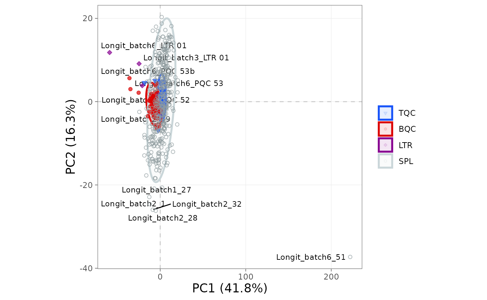

# A basic MRMhub workflow

Tutorial Beginner Prerequisites: [Your First
Analysis](https://slinghub.github.io/MRMhub/quant/articles/tutorial-00-first-analysis.md)

MRMhub processes targeted mass-spectrometry data through an ordered
sequence: import, metadata annotation, normalization, quantification,
drift and batch correction, QC filtering, and export. This tutorial
walks through that full sequence on a lipidomics dataset, using real
file paths, an MSOrganiser metadata template, and a complete exported
report. The examples are deliberately simplified; the [Lipidomics data
processing](https://slinghub.github.io/MRMhub/quant/articles/tutorial-03-lipidomics-workflow.md)
tutorial and the recipes cover dataset- and instrument-specific
variations. After this tutorial you can set up a project, run the
standard pipeline end to end, and export a QC-filtered report.

## 1. Set up a project

To start a new analysis, create an RStudio or Positron project (see
[Using RStudio
Projects](https://support.posit.co/hc/en-us/articles/200526207-Using-RStudio-Projects)
or the [Positron User Guide](https://positron.posit.co/)). A predictable
folder layout keeps raw data, results, and the processing notebook
separate:

    my_study/
    ├── data/           # raw data and metadata files
    ├── output/         # exported results
    └── analysis.Rmd    # your processing notebook

An R Notebook (`.Rmd`) or
[Quarto](https://docs.posit.co/ide/user/ide/guide/documents/quarto-project.html)
(`.qmd`) document is a good home for a processing workflow: it
interleaves code with prose, documenting every decision. Load the
package to begin:

``` r

library(mrmhub)
```

## 2. Create the experiment and import data

The `MRMhubExperiment` object is the central data container in a MRMhub
workflow (see [The MRMhubExperiment
object](https://slinghub.github.io/MRMhub/quant/articles/manual-02-data-object.md)).
We create an empty object, then import peak-area data from an INTEGRATOR
output file; the file also carries some metadata (`qc_type`,
`batch_id`), which we import at the same time.

``` r

myexp <- MRMhubExperiment()
```

``` r

myexp <- import_data_mrmhub(
  myexp,
  path = "datasets/sPerfect_MRMhub.tsv",
  import_metadata = TRUE)
```

    ✔ Imported 499 analyses with 503 features.

    ℹ feature_area selected as default feature intensity. Modify with `set_intensity_var()`.

    ✔ Analysis metadata associated with 499 analyses.

    ✔ Feature metadata associated with 503 features.

MRMhub reads several other formats; [Import and prepare data
files](https://slinghub.github.io/MRMhub/quant/articles/manual-04-data-import.md)
has a decision flowchart and the full importer reference.

## 3. Add metadata

Most processing steps need information absent from the data file:
internal-standard assignments, calibrant concentrations, sample amounts.
Metadata can come from separate CSV or Excel files, from R data frames
(see [Metadata
import](https://slinghub.github.io/MRMhub/quant/articles/manual-05-metadata.md)),
or from an MSOrganiser template:

``` r
myexp <- import_metadata_msorganiser(
  myexp,
  path = "datasets/sPerfect_Metadata.xlsx",
  ignore_warnings = TRUE)
Found no errors, 4 warnings, and no notes in the metadata.
----------------------------------------------------------------------------
  Type  Table    Column                Issue                           Count
1 W*    Analyses analysis_id           Analyses not in analysis data      15
2 W*    Features feature_id            Feature(s) without metadata         1
3 W*    Features feature_id            Feature(s) not in analysis data     4
4 W*    ISTDs    quant_istd_feature_id Internal standard(s) not used       1

----------------------------------------------------------------------------
E = Error, W = Warning, W* = Suppressed Warning, N = Note
----------------------------------------------------------------------------
```

    ✔ Analysis metadata associated with 499 analyses.

    ✔ Feature metadata associated with 502 features.

    ✔ Internal Standard metadata associated with 17 ISTDs.

    ✔ Response curve metadata associated with 12 annotated analyses.

Validation checks may raise warnings, which by default halt the import.
Setting `ignore_warnings = TRUE` lets it proceed; the warnings still
appear in the console table, marked with an asterisk (`*`) in the
`status` column, and should be reviewed so nothing critical is missed.
[Validating and fixing
metadata](https://slinghub.github.io/MRMhub/quant/articles/recipe-04-validate-metadata.md)
shows how to inspect and resolve them.

## 4. Process the data

With data and metadata in place, we run the core pipeline: normalize to
internal standards, quantify, correct run-order drift and between-batch
effects, and filter features on QC criteria.

``` r

myexp <- normalize_by_istd(myexp)
myexp <- quantify_by_istd(myexp)

myexp <- correct_drift_gaussiankernel(
  myexp,
  variable = "conc",
  ref_qc_types = c("SPL"))

myexp <- correct_batch_centering(
  myexp,
  variable = "conc",
  ref_qc_types = "SPL")

myexp <- filter_features_qc(
  myexp,
  include_qualifier = FALSE,
  include_istd = FALSE,
  min.signalblank.median.spl.sblk = 10,
  max.cv.conc.bqc = 25)
```

The drift and batch corrections here are fitted on the study samples
(`ref_qc_types = "SPL"`), which suits large, well-randomised sample
sets. [Drift and batch
correction](https://slinghub.github.io/MRMhub/quant/articles/tutorial-04-drift-correction.md)
covers fitting on dedicated QC samples instead and how to choose a
method.

## 5. Visualize results

A run-scatter plot shows signal against injection order, a quick visual
check on trends and correction quality. We plot a single lipid class
here; [Visualisation
functions](https://slinghub.github.io/MRMhub/quant/articles/manual-08-visualization.md)
lists the full set of plots grouped by workflow stage.

``` r

plot_runscatter(
  myexp,
  variable = "conc",
  include_feature_filter = "PC 4",
  include_istd = FALSE,
  cap_outliers = TRUE,
  log_scale = FALSE,
  output_pdf = FALSE,
  path = "./output/runscatter_PC408_beforecorr.pdf",
  cols_page = 3, rows_page = 2)
```


Figure 1. Run-scatter of PC concentrations by injection order after
drift and batch correction.

## 6. Export and share

Finally, we export results for downstream analysis and archiving: a
detailed Excel report capturing every table and QC metric, a flat CSV of
just the QC-passing concentrations, and the serialized object holding
the complete processing state.

``` r

save_report_xlsx(myexp, path = tempfile(fileext = ".xlsx"))

save_dataset_csv(
  myexp,
  path = tempfile(fileext = ".csv"),
  variable = "conc",
  qc_types = "SPL",
  include_qualifier = FALSE,
  filter_data = TRUE)

saveRDS(myexp, file = tempfile(fileext = ".rds"), compress = TRUE)
```

Figures are exported with
[`save_plot()`](https://slinghub.github.io/MRMhub/quant/reference/save_plot.md),
which writes any plot at a defined size (in mm by default) and, given a
path without an extension, in several formats at once:

``` r

p <- plot_pca(myexp, variable = "conc")

save_plot(p, path = tempfile(), format = c("pdf", "png"), width = 180, height = 120)
```



The `.rds` file preserves the entire `MRMhubExperiment`, so a colleague
can open it in R and run their own plots and QC checks, reproducing the
exact data state without re-running the pipeline.

## Next steps

- [Lipidomics data
  processing](https://slinghub.github.io/MRMhub/quant/articles/tutorial-03-lipidomics-workflow.md):
  a more detailed lipidomics example
- [Drift and batch
  correction](https://slinghub.github.io/MRMhub/quant/articles/tutorial-04-drift-correction.md):
  correction methods and diagnostics
- [Exploring QC: RunScatter and
  PCA](https://slinghub.github.io/MRMhub/quant/articles/tutorial-05-run-scatter.md):
  QC visualisation and outlier screening
- [External calibration and
  QC](https://slinghub.github.io/MRMhub/quant/articles/tutorial-06-external-calibration.md):
  quantitation with calibration curves
